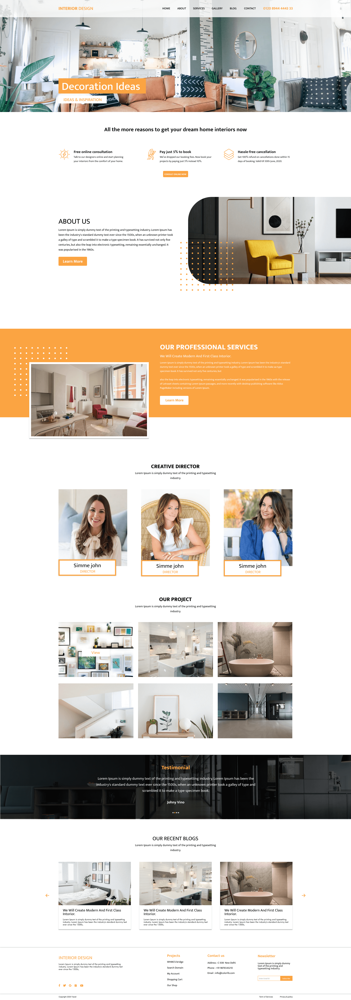

<h1 align="center">Interior Home Design</h1>

<p align="center">	
   <a href="https://www.linkedin.com/in/rafael-goulartb/">
      
   </a>
  <a href="https://github.com/RafaelGoulartB/interior-design-website#readme">
    
  </a>
  <a href="https://github.com/RafaelGoulartB/interior-design-website/graphs/commit-activity">
    
  </a>
  <a href="https://github.com/RafaelGoulartB/interior-design-website/blob/master/LICENSE">
    
  </a>
  
  
  
</p>

> Essa é uma landing page de design de interiores feita com next.js and chakra ui.

<p align="center">
    <a href="README.md">Inglês</a>
    ·
    <a href="README-pt.md">Portugues</a>
 </p>

<div align="center">
  <sub>O Interior home design projeto. Feito com ❤︎ por
    <a href="https://github.com/RafaelGoulartB">Rafael Goulart</a> and
    <a href="https://github.com/RafaelGoulartB/interior-design-website/graphs/contributors">
      contribuidores
    </a>
  </sub>
</div>


<br />
<div align="center">
  
</div>


---

# :pushpin: Tabela de conteúdos

* [Site de Demostração](#eyes-demostração)
* [Tecnologia](#computer-tecnologia)
* [Funcionalidades](#rocket-funcionalidades)
* [Como rodar](#construction_worker-como-rodar)
* [Encontrou um bug? Ou está faltando uma feature?](#bug-problemas)
* [Contribuindo](#tada-contribuindo)
* [Licencia](#closed_book-licencia)

<h2 align="left"> 📥 Layout desponivel em: </h2>
<p align="center">
    <a title="Acess Figma Web" href=https://www.figma.com/file/wzcncKCBHssq9X2gq6aD28/InteriorDesign">
        
    </a>
</p>

# :eyes: Demostração
👉  demo: https://interior-design-website.vercel.app/

# :computer: Tecnologia
Esse projeto foi feito utilizando as seguintes tecnologias:

* [Next.js](https://nextjs.org/)              
* [Chakra UI](https://chakra-ui.com/)    
* [Vercel](https://vercel.com/)    

# :rocket: Funcionalidades

- Landing Page
- About us Section
- Galery of Projects
  
# :construction_worker: Como rodar
### Instale as dependencias
```bash
yarn install
```
### Rode a aplicação
```bash 
yarn dev 
```

Acesse [http://localhost:3000](http://localhost:3000) no seu navegador para ver o resultado.


# :bug: Problemas

Fique a vontade **para criar uma nova issue** com o respectivo titulo e descrição na página de issues do [Interior Design](https://github.com/RafaelGoulartB/interior-design-website/issues) Repositorio. Se você já encontrou a solução para o problema, **Eu amaria fazer o review do seu pull request**!

# :tada: Contribuindo

Confira a página de [contribuição](./CONTRIBUTING.md) para ver como começar uma discução e começar a contribuir.

# :closed_book: Licencia

Lançado em 2020 :closed_book: Licencia

Made with love by [Rafael Goulart](https://github.com/RafaelGoulartB) 🚀.
Esse projeto esta sobre [MIT license](./LICENSE).


Dê uma ⭐️ se esse projeto te ajudou!
